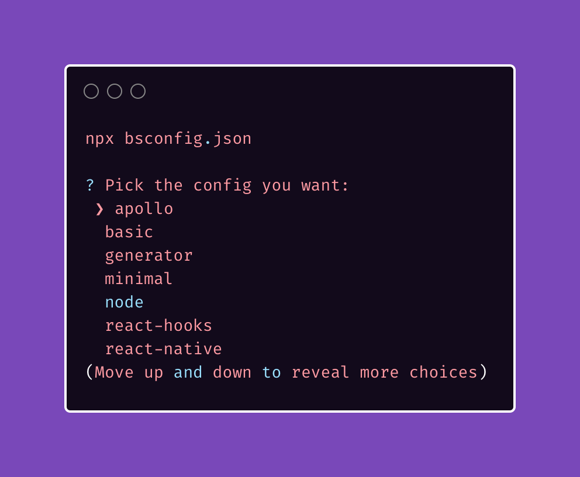

[](https://www.npmjs.com/package/bsconfig.json)
# bsconfig.json

```
npx bsconfig.json

? Pick the framework you're using: 
 ❯ apollo 
  basic 
  generator 
  minimal 
  node 
  react-hooks 
  react-native 
(Move up and down to reveal more choices)
```

The options are the same ones as the `bsconfig.json` file you would have generated by running `bsb -init my-project -theme basic` plus a few other I got sick of writing out like for `reason-apollo-client` and `graphql-ppx` projects.

Also check out:

[resattributes](https://github.com/idkjs/resattributes)

[resgitignore](https://github.com/idkjs/resagitignore)

[mlxre](https://github.com/idkjs/mlxre)

Inspired by [benawad/tsconfig.json](https://github.com/benawad/tsconfig.json)
